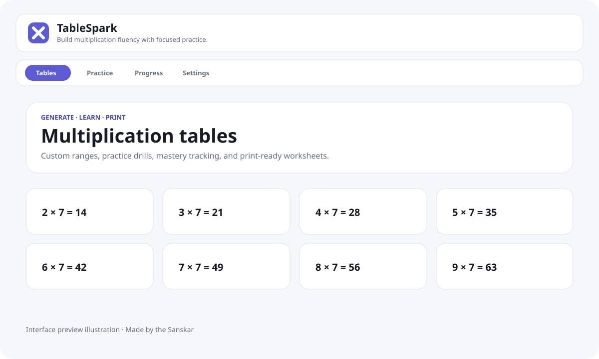

<p align="center">
  
</p>

<h1 align="center">TableSpark</h1>

<p align="center"><strong>Generate multiplication tables, compose printable worksheets, run replayable drills, review mistakes, and build mastery — offline-first and cross-platform.</strong></p>

<p align="center">
  <a href="https://github.com/sanskarIN/tablespark/actions/workflows/ci.yml"></a>
  <a href="https://github.com/sanskarIN/tablespark/actions/workflows/native.yml"></a>
  <a href="https://github.com/sanskarIN/tablespark/actions/workflows/codeql.yml"></a>
  <a href="LICENSE"></a>
</p>

<p align="center">
  <a href="https://buymeacoffee.com/sanskarIN"></a>
</p>

> **Made by the Sanskar** · Open source under the MIT License. Donations are optional and never required to use the product.



> This is a repository interface preview illustration, not release evidence. Real release screenshots are captured by the visual-evidence workflow and still require human review.

## What TableSpark is

TableSpark is a local-first multiplication learning application with one shared React/TypeScript product codebase. Version **2.0.12** can be delivered as:

- a normal web application;
- an installable Progressive Web App (PWA);
- a native Windows application through Tauri 2;
- a native macOS application through Tauri 2;
- a native Linux application through Tauri 2;
- a native Android application through Tauri 2;
- a native iOS/iPadOS application through Tauri 2.

Core learning workflows do not require a TableSpark account, backend, advertising SDK, payment system, or remote analytics service.

The native shell is intentionally thin. Multiplication rules, practice generation, mastery, localization, persistence validation, worksheets, accessibility behavior, and backup compatibility remain in the shared TypeScript product instead of being rewritten separately for every operating system.

## Features

### Tables and printable worksheets

- Generate custom multiplication table and multiplier ranges.
- Configure table step size.
- Protect rendering with a 5,000-row worksheet budget.
- Produce solved study sheets, blank-answer practice worksheets, or answer keys.
- Choose writing-line, box, or open-space answer blanks.
- Choose A4 or US Letter portrait output.
- Choose one, two, or three print columns.
- Keep local profile names out of printed learner metadata by default.

### Practice

- Random generated drills with visible reproducible unsigned 32-bit seeds.
- Timed or untimed practice.
- Starter, Foundation, Builder, Fluency, Challenge, and Custom difficulty modes.
- Immediate answer feedback.
- Bounded whole-number responses.
- New-random-drill and repeat-seed flows.
- Recent-mistake review with commutative duplicates removed.
- Optional browser/system speech synthesis where the active runtime supports it.

### Progress and learning records

- Per-fact attempts, accuracy, streak, and mastery tracking.
- Canonical commutative facts, so `4 × 7` and `7 × 4` share progress.
- Transparent mastered rule: at least three attempts and at least 90% accuracy.
- Progress search and All / Needs practice / Mastered filters.
- Bounded local session summaries with configurable retention.
- Optional non-punitive mastered-facts goals.

### Offline profiles, backup, and recovery

- Up to 100 local learner profiles without sign-in.
- Schema-versioned learner data with schema-1-to-schema-2 migration.
- Shared 2 MB persisted/imported-state budget.
- Structural and semantic validation before stored/imported data is trusted.
- Validated JSON backup export/import.
- Explicit recovery for known-invalid stored data.
- Safe handling when the platform refuses or blocks local-storage reads/writes.
- Transactional destructive backup replacement: persist first, then replace active state.

A browser/PWA installation and a native installation use separate platform-managed storage sandboxes. To move learner data between installations or devices, use TableSpark’s validated backup export/import instead of copying private runtime storage manually.

### Languages

- English source interface.
- Complete Hindi (`हिन्दी`) interface catalog.
- Persisted locale selection.
- Automatic `<html lang>` updates.
- Typed locale-catalog parity checks.

See [docs/localization.md](docs/localization.md).

### Accessibility and classroom use

- Keyboard-operable controls and navigation.
- Visible focus states and skip link.
- Semantic labels, alerts, live regions, and landmarks.
- Large-text classroom mode.
- Reduced-motion preference.
- Touch-friendly responsive controls.
- In-app keyboard shortcut reference.
- Platform/runtime-aware speech fallback.
- Print output designed not to expose the active local profile name automatically.

Manual NVDA, Narrator, VoiceOver, and TalkBack release checks remain evidence gates and are not replaced by automated browser tests. See [docs/accessibility.md](docs/accessibility.md).

## Supported platforms

| Platform | Browser/PWA | Native package source/build support | Production distribution note |
| --- | --- | --- | --- |
| Web | ✅ Primary | N/A | Static HTTPS hosting |
| Windows 10/11 | ✅ | ✅ Tauri desktop | Signed installer/package recommended for public distribution |
| macOS | ✅ | ✅ Tauri desktop | Apple signing/notarization required for normal public distribution |
| Linux | ✅ | ✅ Tauri desktop | Package format depends on target distribution |
| Android | ✅ | ✅ Tauri mobile | Release APK/AAB requires Android signing; Play distribution requires store ownership |
| iOS/iPadOS | ✅ | ✅ Tauri mobile | Device/App Store distribution requires Apple signing/provisioning |

Cross-platform **source/build support is part of the repository**. Signed store publishing is a release-operations step because signing identities, developer accounts, and private keys must belong to the repository owner and must never be committed.

See [docs/native-packaging-evaluation.md](docs/native-packaging-evaluation.md) for the complete native architecture, prerequisites, commands, storage behavior, CI strategy, and signing boundaries.

## Web/PWA versus packaged native behavior

Web/PWA builds register the production service worker and can show non-blocking browser update/install prompts.

Packaged Tauri builds do not register the PWA service worker. Their assets are owned by the native package lifecycle, avoiding a second service-worker updater inside the native webview.

GitHub, support, funding, and email links use ordinary browser behavior on the web. Inside native builds, those destinations are handed to the operating system through a narrowly scoped Tauri opener permission instead of navigating the app webview away from TableSpark.

## Tech stack

Shared product:

- TypeScript in strict mode
- React
- Vite
- Zod
- `vite-plugin-pwa` / Workbox for web/PWA delivery
- Vitest + Testing Library
- fast-check
- Playwright
- ESLint + JSX accessibility rules
- Prettier

Native delivery:

- Tauri 2
- Rust
- `@tauri-apps/plugin-opener`
- system webviews on each supported native platform
- generated Android/iOS IDE projects from maintained Tauri configuration

Repository/release tooling:

- Node built-in test runner for repository utilities
- GitHub Actions
- CodeQL
- Dependabot
- repository secret scanner
- documentation-link checker
- native-configuration consistency checker

## Quick start — web

Prerequisites:

- Git
- Node.js 22.12.0 or newer
- npm 10 or newer
- a modern browser

```bash
git clone https://github.com/sanskarIN/tablespark.git
cd tablespark
npm install
npm run dev
```

Vite serves development on `http://localhost:5173` by default.

## Quick start — desktop native

Install the platform-specific Tauri prerequisites described in [docs/native-packaging-evaluation.md](docs/native-packaging-evaluation.md), then:

```bash
npm install
npm run native:info
npm run native:dev
```

Compile the host-platform native app without installer bundling/signing:

```bash
npm run native:build:ci
```

Create the bundles supported by the current host:

```bash
npm run native:build
```

A Windows host builds Windows artifacts, macOS builds macOS artifacts, and Linux builds Linux artifacts. TableSpark does not assume every desktop target can be safely cross-compiled from one machine.

## Quick start — Android

After installing the Android SDK, NDK, Java, and required Rust targets:

```bash
npm install
npm run android:init
npm run android:dev
```

Build Android packages:

```bash
npm run android:build
```

For a debug APK path:

```bash
npm run android:build:debug
```

The maintained Android minimum SDK is 24.

## Quick start — iOS/iPadOS

iOS development requires macOS with full Xcode tooling.

```bash
npm install
npm run ios:init
npm run ios:dev
```

Build after Apple signing is configured:

```bash
npm run ios:build
```

Simulator-oriented build:

```bash
npm run ios:build:simulator
```

The maintained iOS minimum system version is 14.0.

## Development commands

Web/application quality:

```bash
npm run format:check
npm run lint
npm run typecheck
npm run test
npm run test:coverage
npm run test:security
npm run secret:scan
npm run test:docs
npm run test:native-config
npm run native:config:check
npm run build
npm run check
npm run test:e2e
```

Native quality/build:

```bash
npm run native:info
npm run native:fmt:check
npm run native:check
npm run check:native
npm run native:dev
npm run native:build:ci
npm run native:build
```

Mobile:

```bash
npm run android:init
npm run android:dev
npm run android:build
npm run ios:init
npm run ios:dev
npm run ios:build
```

`npm run check` includes the Node-based native configuration tests/check, so package version, Tauri configuration, identifier, mobile minimums, and required scripts cannot silently drift. Rust/native compilation is separately exercised by the Native Cross-Platform GitHub Actions workflow.

## Architecture overview

```text
shared React / TypeScript product
        │
        ├── Web / PWA → Vite + service worker
        │
        └── Native → Vite assets → Tauri 2 → system webview
                               ├── Windows
                               ├── macOS
                               ├── Linux
                               ├── Android
                               └── iOS/iPadOS
```

Repository layers:

- `src/domain/` — pure multiplication, question, mastery, review, session, worksheet, and validation rules.
- `src/features/` — user-facing product screens.
- `src/state/` — local profiles, settings, learning records, persistence health, and recovery wiring.
- `src/infrastructure/` — persistence, migrations, speech, random seed, browser preferences, PWA events, and logging.
- `src/platform/` — web/native runtime detection and native-safe platform bridges.
- `src/components/` — shared application states and banners.
- `src/i18n/` — typed English/Hindi runtime catalogs.
- `src-tauri/` — maintained Rust/Tauri native shell and platform configuration.
- `scripts/` — repository quality/security/configuration utilities.
- `e2e/` — browser-level product verification.
- `docs/` — architecture, operations, security, accessibility, release, and user documentation.

Generated native projects under `src-tauri/gen/` and Rust output under `src-tauri/target/` are intentionally ignored and regenerated by the Tauri toolchain.

## Data, security, and privacy

TableSpark stores profiles, settings, mastery statistics, recent mistakes, bounded session summaries, and optional goals in local runtime storage. No TableSpark server account is required for core functionality.

Security controls include:

- schema-versioned structural and semantic validation;
- migration of supported older learner data;
- explicit invalid/unavailable storage states;
- 2 MB persistence/import budget;
- transactional backup replacement;
- narrowly scoped native URL-opening permission;
- no general native shell/process/filesystem permission;
- ignored native signing credentials;
- structured log redaction;
- repository secret scanning;
- CodeQL and production dependency auditing;
- release artifact integrity metadata for the web package.

Never commit Android keystores, Apple signing keys/certificates, provisioning profiles, passwords, private learner backups, or raw recovery data.

Read [PRIVACY.md](PRIVACY.md), [SECURITY.md](SECURITY.md), and [docs/security-model.md](docs/security-model.md).

## Testing and CI

The repository combines:

- domain/unit/property tests;
- persistence/migration/semantic validation tests;
- React integration tests;
- localization/catalog tests;
- native configuration drift tests;
- Playwright browser journeys;
- repository scanner/link-checker tests;
- CodeQL;
- web CI;
- native cross-platform CI.

`.github/workflows/native.yml` compiles the desktop native application without installer signing/bundling on Windows, macOS, and Linux and verifies Android/iOS project generation on appropriate GitHub-hosted operating systems.

Signing and store submission are intentionally excluded from untrusted pull-request CI.

See [docs/testing.md](docs/testing.md) and [docs/ci-cd.md](docs/ci-cd.md).

## Build and release

Web production build:

```bash
npm run build
```

Web tagged release automation currently packages:

```text
tablespark-web.zip
tablespark-web.zip.sha256
```

Native package generation is available through the platform commands above. Public native release artifacts must be signed/notarized/provisioned according to their platform before being described as production releases.

The `v2.0.12` tag should not be created until the exact candidate head passes required repository checks and the intended manual/platform release gates are complete.

See [docs/release.md](docs/release.md) and [docs/release-evidence.md](docs/release-evidence.md).

## Deployment status

`dist/` remains suitable for static HTTPS hosting. Native desktop/mobile applications can package the same built frontend locally through Tauri.

Production web-origin approval, signed native distribution identities, store ownership, real-device behavior, manual screen-reader checks, and release artifact review are operational release gates and are not inferred from source code alone.

## Contributing

Read:

- [CONTRIBUTING.md](CONTRIBUTING.md)
- [CODE_OF_CONDUCT.md](CODE_OF_CONDUCT.md)
- [SECURITY.md](SECURITY.md)

Use focused commits and add tests for behavior changes. Do not include credentials, native signing material, private learner data, or raw recovery data in issues, pull requests, fixtures, artifacts, or commits.

The intended local Git commit email for this project is `sanskarin@outlook.in`.

## Documentation

- [Documentation index](docs/documentation-index.md)
- [Architecture](docs/architecture.md)
- [Native packaging and cross-platform architecture](docs/native-packaging-evaluation.md)
- [Setup](docs/setup.md)
- [Development](docs/development.md)
- [Testing](docs/testing.md)
- [CI/CD](docs/ci-cd.md)
- [User guide](docs/user-guide.md)
- [Localization](docs/localization.md)
- [Accessibility](docs/accessibility.md)
- [State and persistence](docs/state-and-persistence.md)
- [Security model](docs/security-model.md)
- [Release](docs/release.md)
- [Release evidence](docs/release-evidence.md)
- [Deployment evaluation](docs/deployment-evaluation.md)
- [Troubleshooting](docs/troubleshooting.md)
- [Performance](docs/performance.md)
- [Repository settings](docs/repository-settings.md)
- [Roadmap](ROADMAP.md)
- [Changelog](CHANGELOG.md)
- [Current handoff](what_changed.md)

## License

TableSpark is licensed under the [MIT License](LICENSE).

## Contact and support

- Business: `sanskarin@outlook.in`
- Business: `sanskarin.business@gmail.com`
- Support: `supportramsandesh@gmail.com`
- GitHub: https://github.com/sanskarIN
- Repository: https://github.com/sanskarIN/tablespark
- Buy Me a Coffee: https://buymeacoffee.com/sanskarIN

### Optional funding

[](https://buymeacoffee.com/sanskarIN)

**Made by the Sanskar**
